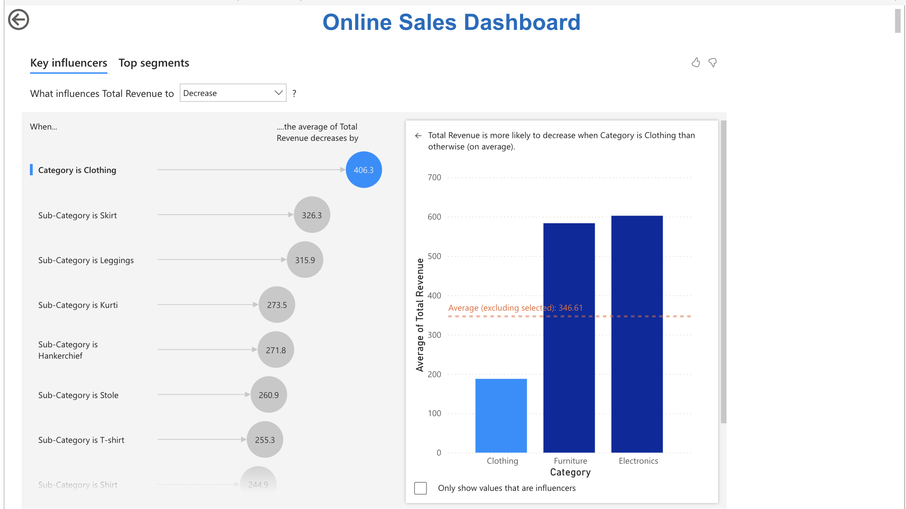
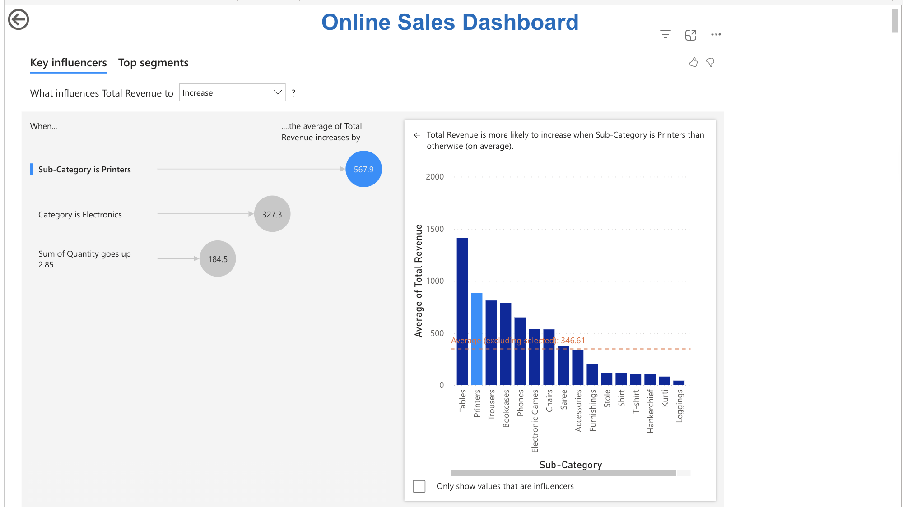

# sales-analysis

## Product Overviews

## Revenue and Profit

## Key Influencer Decrease Case

## Key Influencer Increase Case

## Microsoft Power BI
Online Sales Analysis [Dashboard Demo](https://app.powerbi.com/Redirect?action=openreport&context=Annotate&ctid=2017eaab-53af-49e9-8125-5d60a193d9ad&pbi_source=mobile_android&groupObjectId=f7f00b67-d0b5-4f28-958a-e609e9660223&reportObjectId=930a6a61-8d34-42a2-a316-da6fe75acfb1&reportPage=1f2440fd0370d6ce9f69&bookmarkGuid=1f96d5f4-ff04-475b-97c3-a743a789f1bc&fullScreen=0)

## Dataset
We used the [Online Sales Data from Kaggle](https://www.kaggle.com/datasets/samruddhi4040/online-sales-data) 

